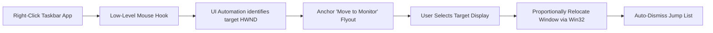

# DisplayHop 🚀
### Seamless Multi-Monitor Window Teleportation for the Windows 11 Taskbar

[](https://www.rust-lang.org/)
[](https://microsoft.com/windows)
[](LICENSE)
[](tests/)
[]()
[]()

> **Ever right-clicked an app on your Windows 11 taskbar and wondered why there is no option to move it to your other screen?**  
> **DisplayHop** fixes that. It latches a native-feeling Windows 11 flyout right onto the taskbar Jump List, letting you teleport any open application to any connected display with a single click.

---

## 💡 Why DisplayHop?

In Windows 11, Microsoft modernized the taskbar and Jump List menus, but left out a critical productivity feature for multi-monitor setups: **direct display switching**.

If you use 2, 3, or more monitors (especially mixed setups like an Ultrawide paired with standard displays, or high-DPI 4K screens):
- Dragging windows across expansive desktop real estate is slow and cumbersome.
- The standard shortcut (`Win + Shift + Left / Right`) forces you to cycle blindly through screens in sequential order without knowing where your window will land.
- Minimizing, hunting for off-screen windows, or dealing with games stuck on the wrong monitor disrupts your workflow.

**DisplayHop** bridges this gap seamlessly: **Right-click any app on your taskbar &rarr; Click the target display &rarr; Done.**

---

## ✨ Features

- 🎯 **Taskbar-Native Latching**  
  Right-click any application button on either your Primary or Secondary taskbar. DisplayHop detects the targeted application using Microsoft UI Automation and anchors a companion flyout directly above the native Jump List.

- 🖥️ **Instant Multi-Display Teleportation**  
  Hover over **Move to Monitor** to view a live menu of all connected screens, labeled with their display numbers, active resolutions, and primary display tags. One click transports the window immediately.

- 🪟 **Smart Window State Preservation**  
  - **Maximized Windows**: Automatically restored, repositioned to the target monitor's working area, and re-maximized without glitching.
  - **Borderless Fullscreen**: Automatically spans the full canvas of the target display.
  - **Floating Windows**: Coordinates are proportionally scaled and clamped within the target display's working area, preventing windows from spawning partially off-screen or behind the taskbar.

- 🎨 **Windows 11 Fluent Aesthetics**  
  Built with native Win32 Desktop Window Manager (DWM) integration:
  - Dark Mode color palette matching Windows 11 context menus.
  - Hardware-accelerated rounded corners (`DWMWCP_ROUND`).
  - Per-Monitor V2 DPI awareness for pixel-perfect typography and scaling across 100%, 125%, 150%, and 200% displays.

- 🛡️ **Administrator / UIPI Aware**  
  Windows User Interface Privilege Isolation (UIPI) prohibits standard programs from manipulating elevated windows (such as Administrator PowerShell or CMD). DisplayHop detects this condition, alerts you via a native notification, and offers a 1-click **"Restart as Administrator"** option in the tray.

- 🧹 **Jump List Auto-Dismissal**  
  Once you click a target display, DisplayHop automatically dismisses the native Jump List so your desktop stays clean and ready for work.

- ⚡ **Pure Rust & Zero Bloat**  
  - **No Electron, no Chromium, no .NET Framework, no external DLL dependencies.**
  - Compiled to a single standalone executable (~300 KB).
  - Idle RAM consumption of only ~3&ndash;4 MB with 0% background CPU usage.

- 🔄 **Hot-Process Replacement**  
  Launching a new build or clicking the app again automatically detects the existing background instance, gracefully shuts it down, and takes over without duplicate tray icons or zombie processes.

---

## 🎬 How It Works



1. **Detection**: A low-level mouse hook (`WH_MOUSE_LL`) detects right-clicks originating from Windows taskbar bars (`Shell_TrayWnd` and `Shell_SecondaryTrayWnd`).
2. **Identification**: Microsoft UI Automation (`IUIAutomation`) inspects the UI element under the cursor to resolve the exact application window handle (`HWND`), filtering out explorer chrome.
3. **Menu Display**: A layered companion window is rendered adjacent to the native Jump List with Per-Monitor V2 DPI scaling and boundary overflow protection.
4. **Relocation**: Win32 window management calculates proportional positions, adjusts for target monitor work areas, restores and re-maximizes if required, and brings the window to the foreground.

---

## 🚀 Quick Start

### Running DisplayHop

1. Download the latest `window-display-swapper.exe` from the [Releases](https://github.com/bookamp/DisplayHop/releases/latest) page.
2. Double-click to run. DisplayHop will start quietly in your system tray (notification area).
3. Right-click any app on your taskbar, hover over **Move to Monitor &gt;**, and choose your destination display!

### System Tray Menu

Right-click the DisplayHop icon in your system tray to access:
- **Run at Startup**: Toggles automatic launch on Windows login (via `HKCU\Software\Microsoft\Windows\CurrentVersion\Run`).
- **Restart as Administrator**: Elevates the process with a UAC prompt to allow moving administrative windows.
- **View Debug Log**: Opens the localized diagnostic log (`debug.log`).
- **Exit**: Cleanly shuts down DisplayHop.

---

## 🛠️ Building from Source

### Prerequisites

- [Rust](https://www.rust-lang.org/tools/install) (1.70 or newer, `x86_64-pc-windows-msvc` or `x86_64-pc-windows-gnu`)
- PowerShell 5.1+ (included with Windows)

### Build Commands

Clone the repository:
```bash
git clone https://github.com/your-username/DisplayHop.git
cd DisplayHop
```

Build the release binary with embedded icon resources:
```powershell
powershell -ExecutionPolicy Bypass -File .\build_release.ps1
```

Or build directly via Cargo:
```bash
cargo build --release
```

The compiled standalone binary will be located at:
```
target\release\window-display-swapper.exe
```

---

## 🧪 Comprehensive Unit Tests

The codebase includes comprehensive unit tests verifying taskbar title parsing, noise filtering, monitor boundary math, DPI scaling, and multi-display coordinate mapping:

```bash
cargo test
```

### Test Coverage Highlights
- **Taskbar Search Parser**: Suffix stripping (`" - 1 running window"`), tokenization, noise word elimination, deduplication.
- **Monitor Point Inclusion**: Rectangular inclusivity/exclusivity, multi-monitor setups with negative coordinates (screens placed to the left or above the primary display).
- **DPI Scaling**: Exact pixel scaling across 96 DPI (100%), 120 DPI (125%), 144 DPI (150%), and 192 DPI (200%).
- **Submenu Layout**: Screen edge detection, automatic left/right flipping when nearing monitor boundaries.
- **Window Mover Calculations**: Aspect ratio preservation, downscaling 4K windows onto 1080p displays, border clamping, and coordinate translation.

---

## 🤝 Contributing

Contributions, bug reports, and feature requests are welcome!
1. Fork the repository.
2. Create your feature branch (`git checkout -b feature/amazing-feature`).
3. Ensure all tests pass (`cargo test`).
4. Commit your changes (`git commit -m 'Add amazing feature'`).
5. Push to the branch (`git push origin feature/amazing-feature`).
6. Open a Pull Request.

---

## 📄 License

Distributed under the **MIT License**. See `LICENSE` for more information.
